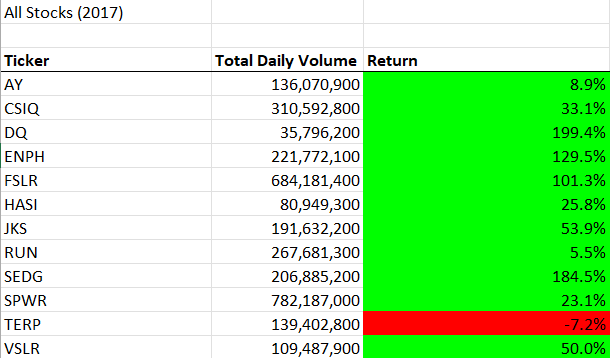
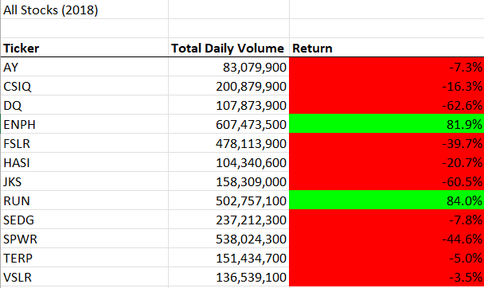
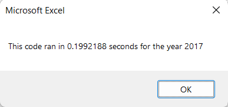
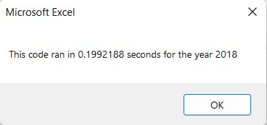

Overview of Project

The purpose of this project was to take the code we had written up to this point for use in analyzing stock performances year over year and refactoring it in order to decrease runtime and make it more easily used. The client had us run an initial project using 12 different stocks, but wished to know the runtime to be able to extrapolate the programs performance over a larger set of data. After reveiwing the runtime, we decided to refactor the code to make it less bloated and more efficient, thereby making the program as a whole more streamlined when used in different ways. We also added a button to run the macro as an extra feature to make it easier to navigate.

Results

2017 was a very strong year for the stocks that were analyzed, with only one returning negatively over the course of the fiscal year and the rest showing positive returns ranging from 5.5% to 199.4%. These results are shown below.

2018, however, was a down year, with almost all stocks showing negative returns aside from two, ENPH and RUN, with the results in detail shown below. 

ENPH was one of the stronger stocks in the previous year, and whatever downturn affected the rest of the businesses may have not been in the market sector that ENPH is a part of and thus they were still a strong performer; outside new market conditions this bodes well as a good stock to invest in. RUN, while on of the lowest performing positive stocks from 2017, grew in return by more than 75%, potentially showing either impressive growth as possibly a business that just is getting off the ground or potentially one that was able to positively take advantage of the market conditions that negatively affected others.

All other stocks showed remarkable volatility over those two years, with more data from past years being necesarry to draw good conclusions regarding if they are wise investments or not.

After refactoring, the code improved in runtime from an average of 0.5 seconds per run to a little over 0.1 seconds per run, as shown in the runtime pictures noted below. This is a significant improvement and bodes well for expansion of the code as 0.4 seconds saved per 12 stocks would save 40 seconds when run for 1200 stocks, and so on and so forth. This would save significant time for future analysis.

Summary

There are many great advantages to refactoring code, such as program efficiency, runtime, file size, and also just overall code cleanliness to make it easier for future edits and modifications. One must be aware and pay attention to the time constriants involved with individual projects however, and apply intelligence to the cost/benefit of amount of refactoring done on any individual project.

For instance, in this project, if the client had no desire for code he could extrapolate for future analysis and merely wanted the quickest analysis possible, very little attempt at refactoring should be made due to time constraints and client demands. This project only analyzed 12 stocks, and while a 0.4 runtime reduction is useful when applied to wider data sets, for quickest analysis possible the client did not need the extra 2 hour wait while the team refactored code for best performance.

However, alternatively, if time allows refactoring typically leads to best practices being used and the code being the most efficient and clean it could be. There is even more refactoring that could be done to this project, for instance, that the team did not do for times sake but would be done if the program were needed to analyze much larger data sets. We speak of course of how even in the refactored code the stock array is still hard coded to the values provided, whereas in a more flexible program it would call a for loop to iterate over the data and generate the array for analysis that way. This would add to runtime, typically not something you want refactoring to do, but would the make the program more useful for future applications and leading to less wasted work in the long run.

In short, one must apply the scope and range of the project intelligently whenever refactoring becomes a demand, so that client expectations are met and business retention is maintained.